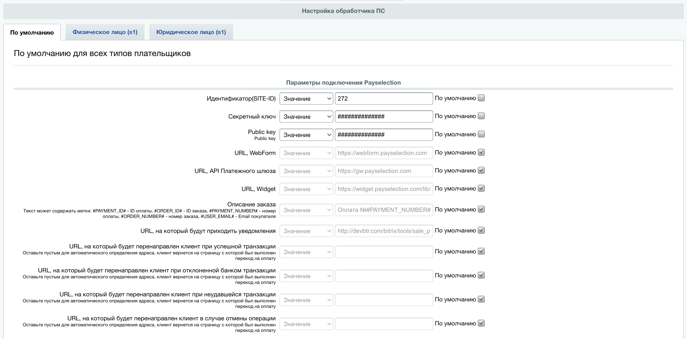
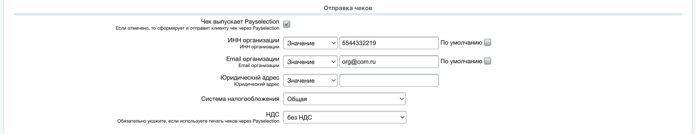

# Модуль оплаты Payselection для 1C-Битрикс

### Возможности

✔ Автоматическая установка флага «Оплачено» при прохождении оплаты.

✔ Одностадийная/двухстадийная схема оплаты.

✔ Отмена/возврат платежей.

✔ Передача информации для печати чеков (54-ФЗ):

* через Payselection;
* если необходимо использовать сторонний сервис, то в настройках ПС уберите галочку «Отправка чеков».

### Установка модуля

* Создайте резервную копию вашего магазина и базы данных
* Скачайте архив модуля [1cbitrix](https://github.com/Payselection/1cbitrix/archive/refs/heads/master.zip)
* Распакуйте архив и скопируйте файлы в каталог `<1C-Bitrix/bitrix/modules/p10102022.p10102022paycode2022`
* Зайдите в зону 1C-Битрикс администратора и выберите меню `Marketplace -> Установленные решения`
* Установите модуль __Модуль оплаты Payselection (p10102022.p10102022paycode2022)__. Будет создана платежная система с обработчиками.

### Настройки модуля

После установки модуля, в Битрикс появится новая платежная система. Ее необходимо включить и настроить.

* Зайти в административную часть интернет-магазина.
* Перейти на страницу Магазин → Настройки → Платежные системы.
* Нажать кнопку "Добавить платежную систему".
* Во вкладке «Платежная система» выбрать «Payselection (p10102022.p10102022paycode2022)» в поле «Обработчик».
* Ввести заголовок, название, описание и сортировку платежной системы, и сделать ее активной.
* Выбрать _Тип платежной системы_: _Виджет/Страница оплаты_
* Введите в полях _Идентификатор(SITE-ID)_, _Секретный ключ_, _Public key_, _URL, WebForm_, _URL, API Платежного шлюза_ и _URL, Widget_ значения, полученные от Payselection.
* Нажать _Сохранить_.

### Настройка интеграции с онлайн-кассами

В настройках платежной системы в разделе _Отправка чеков_ необходимо:
* Включить опцию _Чек выпускает Payselection_
* Выбрать систему налогообложения магазина в раскрывающемся меню _Система налогообложения_
* Выбрать необходимую ставку налога для доставки для передачи в чек в списке _НДС_.
* Заполнить _ИНН организации_
* Заполнить _Email организации_
* Заполнить _Место расчетов. Адрес сайта_

**Внимание!** Для корректной передачи данных чека в онлайн-кассу необходимо:
выставить для всех товаров магазина корректную ставку НДС;
указать в настройках модуля систему налогообложения и ставку налога для доставки.

### Тестовые данные

Для начала интеграции модуля необходимо уточнить следующие параметры:
* Идентификатор(SITE-ID)
* Секретный ключ 
* Public key 
* URL, WebForm 
* URL, API Платежного шлюза 
* URL, Widget 

### Данные тестовой карты:

* Номер карты __4111111111111111__
* Месяц: если <=6 то успешно, если >=7 то отказ
* Год: любой больше либо равно текущему
* CVC __123__
